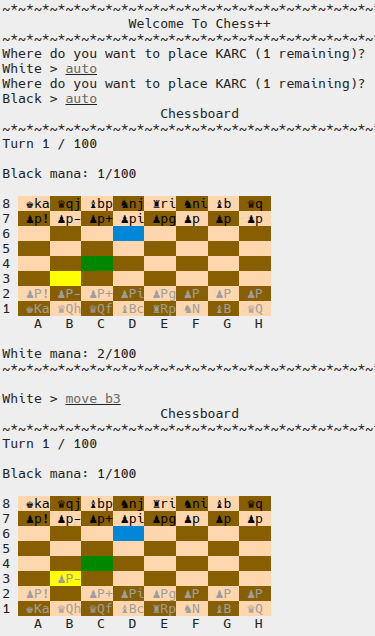
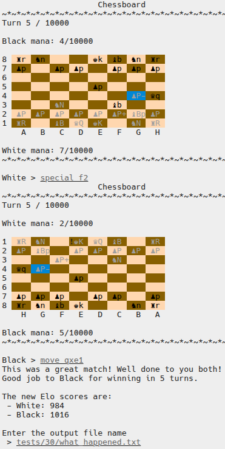
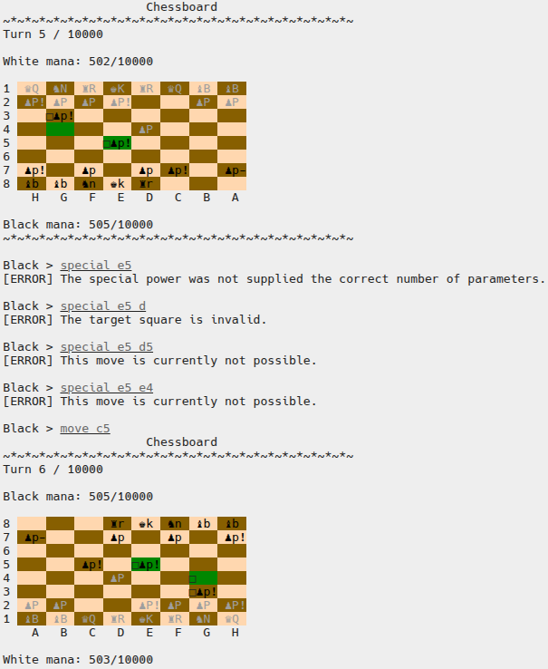

# Chess++

## What is this about
This is one of the TU Graz OOP course assignments. We had to implement fully functioning chess game in the terminal. Moreover as it would have been to easy the game had additional features like pieces with superpowers and special squares.

The work was done in the group of three and the timeframe of one month.

## Tech Stack
The main goal was to understand how the C++ works and how to effectively work in team.

Main areas:
- Classes and Objects
- Inheritance
- Strings and Streams
- Gitlab and Branches
- Clean Doxygen-Style Comments
- Teamwork
- Splitting the workload
- VM Linux
- Test Cases

## Team Expirience
The project turned out to be over ten thousands lines of code. We paid a lot of attention to the work distribution and as a result in the end each member had the same level of contribution. It was really intresting to work in team because not only you have to implement your ideas but you also have to communicate effectively with your teammates. We had a weekly meetings where we explained our progress and discussed the challenges. Most of the time it was about transfering/obtaining information from one class to another.

## Personal Insight
Most of the time the idea was the following: read the description -> find an abstract solution -> make a plan or a scheme -> implement it -> testing and debugging(especially finding edge cases). That means how do we implement this feature, do we need a separate class for it, where can we take the needed information from. Main coding challanges were the smart pointers, constructors(especially copy), proper usage of memory, implementing possibility checks.

## Examples of the game
| | | |
|---|---|---|
|  |  |  |

Published with the consent of the teammates and course autorithies. All rights reserved.
